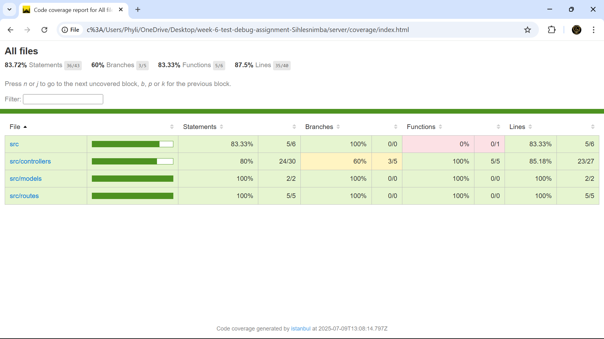
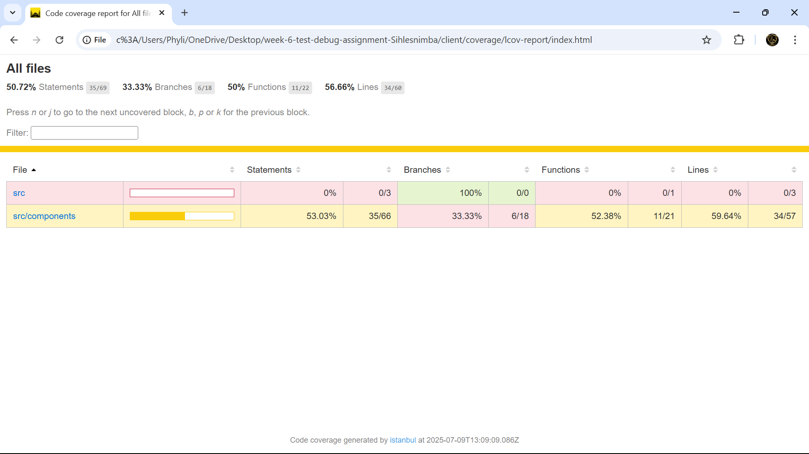

# 🐞 MERN Bug Tracker

A full-stack **Bug Tracker** application built with the **MERN Stack** (MongoDB, Express.js, React.js, Node.js), with a focus on **testing**, **debugging**, and **error handling** best practices.

---

## 📦 Project Structure

```
mern-bug-tracker/
├── client/                 # React frontend
│   ├── src/
│   │   ├── components/     # React components (BugForm, BugList, BugItem)
│   │   ├── tests/          # Frontend tests
│   │   │   ├── unit/       # Component unit tests
│   │   │   └── integration/ # Component integration tests
│   │   └── App.jsx
│   └── public/
├── server/                 # Express backend
│   ├── src/
│   │   ├── controllers/    # Route controllers
│   │   ├── models/         # Mongoose models
│   │   ├── routes/         # Express routes
│   │   ├── middleware/     # Error handling middleware
│   │   ├── app.js          # App config
│   │   └── index.js        # Entry point
│   └── tests/              # Backend tests
│       ├── unit/           # Controller unit tests
│       └── integration/    # API integration tests
├── .env
├── package.json
└── README.md
```

---

## 🚀 Features

- Report new bugs
- View a list of all bugs
- Update bug status (open, in-progress, resolved)
- Delete bugs
- Error handling on both frontend and backend
- Testing coverage for both layers

---

## 🧪 Testing Overview

### ✅ Backend (Jest + Supertest)

- Unit test: `createBug` controller with mocked request/response
- Integration test: All CRUD routes tested via `/api/bugs` endpoints

### ✅ Frontend (React Testing Library)

- `BugForm`: Inputs, button click logic
- `BugItem`: Update/delete behavior (mocked)
- `BugList`: API call and render test with mocked fetch

### ✅ Testing Tools Used

- `jest`
- `supertest`
- `@testing-library/react`

To run backend tests:

```bash
cd server
npm test
```

To run frontend tests:

```bash
cd client
npm test
```

---

## 🐛 Debugging Techniques Used

- **Console logs** in controller functions and fetch errors
- **Chrome DevTools** to inspect network requests
- **React Error Boundary** to gracefully catch rendering errors
- **Express error middleware** to handle and return error JSON

---

## 🛠️ How to Run the App

### 1. Clone the repo

```bash
git clone https://github.com/PLP-MERN-Stack-Development/week-6-test-debug-assignment-Sihlesnimba.git
cd week-6-test-debug-assignment-Sihlesnimba
```

### 2. Setup Backend

```bash
cd server
npm install
cp .env.example .env  # Or create your own
npm run dev
```

Ensure your `.env` contains:

```
MONGO_URI=mongodb://localhost:27017/bugtracker
```

### 3. Setup Frontend

```bash
cd ../client
npm install
npm start
```

Open your browser at [http://localhost:3000](http://localhost:3000)

---

## 🧹 Future Improvements

- Authentication (to assign bugs to users)
- Bug priority levels
- Project boards or Kanban view

---

## 📸 Test Coverage Reports

### Backend Coverage



### Frontend Coverage



---

## ✅ Submission

Pushed to GitHub Classroom repo:
[https://github.com/PLP-MERN-Stack-Development/week-6-test-debug-assignment-Sihlesnimba](https://github.com/PLP-MERN-Stack-Development/week-6-test-debug-assignment-Sihlesnimba)
